# Awesome-GUI-Agents
A curated list for **GUI Agents**

**Table Content:** 

- [Updates](#updates) 
- [Contributing](#contri) 
- [Four Module of GUI Agents](#module)
- [Paper List](#paper-list) 
  - [GUI Agents List](#agentlist) 
  - [GUI Agents Datasets & Benchmark List](#datasets) 

## 🚀 [Updates](#updates) 
* September 16, 2025: We released our new paper on GUI Automation: **UI-S1: Advancing GUI Automation via Semi-online Reinforcement Learning**
    - 📄 [arXiv 2509.11543](https://arxiv.org/pdf/2509.11543)  
    - 🤗 [Hugging Face Papers](https://huggingface.co/papers/2509.11543)  
    - 💻 [GitHub Project](https://github.com/X-PLUG/MobileAgent/tree/main/UI-S1)  
* Augest 18, 2025: We open-source our GUI-G2-3B and GUI-G2-7B models. Try it out.

  - 
  - 

* Augest 14, 2025: We released our new paper on GUI Grounding: **Test-Time Reinforcement Learning for GUI Grounding via Region Consistency**
  - 📄 [arXiv 2508.05615](https://arxiv.org/abs/2508.05615)   
  - 💻 [GitHub Project](https://github.com/zju-real/gui-rcpo)  

* August 1, 2025: **We will add a weekly section summarizing GUI Agent research papers. Stay tuned!**

* July 22, 2025: **We released our new paper on GUI Grounding: GUI-G²: Gaussian Reward Modeling for GUI Grounding. [Check it out](https://arxiv.org/abs/2507.15846)!**
  - 📄 [arXiv 2507.15846](https://arxiv.org/abs/2507.15846)  
  - 🤗 [Hugging Face Papers](https://huggingface.co/papers/2507.15846)  
  - 💻 [GitHub Project](https://github.com/zju-real/GUI-G2)  
  - 🌐 [Project Page](https://zju-real.github.io/GUI-G2/)

* April 22, 2025: We're excited to announce that our paper has been published and is now available on arXiv. We welcome your attention and feedback! [Check it out](https://arxiv.org/abs/2504.13865). We updated GUI Agents List based on RL (R1 Style). 
  
* April 2, 2025: We have already uploaded the paper to arXiv, please wait for some time. Meanwhile, we will keep updating this repo.

* March 24, 2025: We updated the repository and released our comprehensive survey on GUI Agents.

## 💮 [Contributing](#contri)

If you'd like to include your paper, or need to update any details such as github repo information or code URLs, please feel free to submit a pull request. 

## 📚 Weekly Paper List

📚 2025-8-25 to 2025-8-29 📚

**Weekly Paper List：**
1. Structuring GUI Elements through Vision Language Models: Towards Action Space Generation
2. WEBSIGHT: A Vision-First Architecture for Robust Web Agents
3. PerPilot: Personalizing VLM-based Mobile Agents via Memory and Exploration
4. UItron: Foundational GUI Agent with Advanced Perception and Planning

📚 2025-8-18 to 2025-8-22 📚

**Weekly Paper List：**
1. CRAFT-GUI: Curriculum-Reinforced Agent For GUI Tasks
2. COMPUTERRL: SCALING END-TO-END ONLINE REINFORCEMENT LEARNING FOR COMPUTER USE AGENTS
3. Mobile-Agent-v3: Foundamental Agents for GUI Automation
4. SWIRL: A STAGED WORKFLOW FOR INTERLEAVED REINFORCEMENT LEARNING IN MOBILE GUI CONTROL

📚 2025-8-11 to 2025-8-15 📚

**Weekly Paper List：**
1. OPENCUA: Open Foundations for Computer-Use Agents
2. Test-Time Reinforcement Learning for GUI Grounding via Region Consistency
3. WinSpot: A Windows GUI Grounding Benchmark with Multimodal Large Language Models
4. InfiGUI-G1: Advancing GUI Grounding with Adaptive Exploration Policy Optimization
5. UI-Venus Technical Report: Building High-performance UI Agents with RFT

## [Four Module of GUI Agents](#module)

We have divided GUI Agents into four modules: perception, exploration, planning, and interaction, as shown below:

## [Paper List](#paperlist)

We have dedicated a separate chapter to datasets and benchmarks for GUI Agents, with all content presented in chronological order.

### Technical Report

Mano Technical Report

SCALECUA: SCALING OPEN-SOURCE COMPUTER USE AGENTS WITH CROSS-PLATFORM DATA

UI-TARS-2 Technical Report: Advancing GUI Agent with Multi-Turn Reinforcement Learning

CODA: COORDINATING THE CEREBRUM AND CEREBELLUM FOR A DUAL-BRAIN COMPUTER USE AGENT WITH DECOUPLED REINFORCEMENT LEARNING.

UItron: Foundational GUI Agent with Advanced Perception and Planning

Mobile-Agent-v3: Foundamental Agents for GUI Automation

UI-Venus Technical Report: Building High-performance UI Agents with RFT

OPENCUA: Open Foundations for Computer-Use Agents

MAGICGUI: A FOUNDATIONAL MOBILE GUI AGENT WITH SCALABLE DATA PIPELINE AND REINFORCEMENT FINE-TUNING

Magentic-UI: Towards Human-in-the-loop Agentic Systems

Phi-Ground Tech Report: Advancing Perception in GUI Grounding

[MobileGUI-RL: Advancing Mobile GUI Agent through Reinforcement Learning in Online Environment](https://www.arxiv.org/pdf/2507.05720)

[GTA1: GUI Test-time Scaling Agent](https://arxiv.org/pdf/2507.05791v1)

[MiMo-VL Technical Report](https://arxiv.org/abs/2506.03569)

[AgentCPM-GUI: Building Mobile-Use Agents with Reinforcement Fine-Tuning](https://arxiv.org/pdf/2506.01391)

[UI-TARS: Pioneering Automated GUI Interaction with Native Agents](https://arxiv.org/abs/2501.12326)

### Memory for GUI Agents
2025-10-13: AUTO-SCALING CONTINUOUS MEMORY FOR GUI AGENT

### Online RL 
EFFICIENT MULTI-TURN RL FOR GUI AGENTS VIA DECOUPLED TRAINING AND ADAPTIVE DATA CURATION

UI-S1: Advancing GUI Automation via Semi-online Reinforcement Learning

MOBILERL: ADVANCING MOBILE USE AGENTS WITH ADAPTIVE ONLINE REINFORCEMENT LEARNING

COMPUTERRL: SCALING END-TO-END ONLINE REINFORCEMENT LEARNING FOR COMPUTER USE AGENTS

Mobile-Agent-v3: Foundamental Agents for GUI Automation

### GUI Navigation Benchmark
MemGUI-Bench: Benchmarking Memory of Mobile GUI Agents in Dynamic Environments

2025-09: MAS-Bench: A Unified Benchmark for Shortcut-Augmented Hybrid Mobile GUI Agents 

2025-08: UI-NEXUS: Atomic-to-Compositional Generalization for Mobile Agents with A New Benchmark and Scheduling System

2025-07: MMBENCH-GUI: HIERARCHICAL MULTI-PLATFORM EVALUATION FRAMEWORK FOR GUI AGENTS
We will organize these points later:

1、AndroidWorld

2、AndroidControl

3、GUI-Odyssey

4、Amex

5、WebArena

6、WebSRC_v1.0

7、Mind2Web 2

8、... stay tuned

### Multi-turn GUI Agent
2025-10: EFFICIENT MULTI-TURN RL FOR GUI AGENTS VIA DECOUPLED TRAINING AND ADAPTIVE DATA CURATION

2025-09: UI-S1: Advancing GUI Automation via Semi-online Reinforcement Learning

2025-05: ARPO: End-to-End Policy Optimization for GUI Agents with Experience Replay

2025-05: WEBAGENT-R1: Training Web Agents via End-to-End Multi-Turn Reinforcement Learning

### Training Free GUI Grounding
1、Attention-driven GUI Grounding: Leveraging Pretrained Multimodal Large Language Models without Fine-Tuning [2025AAAI]

### Zero Cost GUI Agent
2025-6-02: ZeroGUI: Automating Online GUI Learning at Zero Human Cost

### GUI Grounding Benchmark
WinSpot: A Windows GUI Grounding Benchmark with Multimodal Large Language Models

UI-Vision: A Desktop-centric GUI Benchmark for Visual Perception and Interaction [2025ICML]

[ScreenSpot](https://huggingface.co/datasets/rootsautomation/ScreenSpot): [SeeClick: Harnessing GUI Grounding for Advanced Visual GUI Agents](https://arxiv.org/abs/2401.10935)

[ScreenSpot-V2](https://huggingface.co/datasets/OS-Copilot/ScreenSpot-v2): [OS-ATLAS: Foundation Action Model for Generalist GUI Agents](https://arxiv.org/abs/2410.23218)

[ScreenSpot-Pro](https://huggingface.co/datasets/likaixin/ScreenSpot-Pro): [ScreenSpot-Pro: GUI Grounding for Professional High-Resolution Computer Use](https://likaixin2000.github.io/papers/ScreenSpot_Pro.pdf)

[CA-GUI](https://huggingface.co/datasets/openbmb/CAGUI): [AgentCPM-GUI: An on-device GUI agent for operating Android apps, enhancing reasoning ability with reinforcement fine-tuning for efficient task execution.](https://github.com/OpenBMB/AgentCPM-GUI)

### Video GUI
desc: using video to assist gui agent learn

Scalable Video-to-Dataset Generation for Cross-Platform Mobile Agents

ASSISTGUI: Task-Oriented Desktop Graphical User Interface Automation

VideoGUI: A Benchmark for GUI Automation from Instructional Videos

Mobile-Agent-V: A Video-Guided Approach for Effortless and Efficient Operational Knowledge Injection in Mobile Automation

Watch and Learn: Learning to Use Computers from Online Videos

### Test-Scaling Method (GUI Grounding && GUI Navigation) (Zoom In && Zoom Out)
1、Test-Time Reinforcement Learning for GUI Grounding via Region Consistency

2、GTA1: GUI Test-time Scaling Agent

3、DiMo-GUI: Advancing Test-time Scaling in GUI Grounding via Modality-Aware Visual Reasoning [2025 EMNLP]

4、Improved GUI Grounding via Iterative Narrowing

5、Visual Test-time Scaling for GUI Agent Grounding

6、UI-AGILE: Advancing GUI Agents with Effective Reinforcement Learning and Precise Inference-Time Grounding

7、GENERALIST SCANNER MEETS SPECIALIST LOCATOR: A SYNERGISTIC COARSE-TO-FINE FRAMEWORK FOR ROBUST GUI GROUNDING

### Prune
2025-10-01: GUI-KV: EFFICIENT GUI AGENTS VIA KV CACHE WITH SPATIO-TEMPORAL AWARENESS

### R1-Style GUI Agents
2025-10-04: GUI-SPOTLIGHT: ADAPTIVE ITERATIVE FOCUS REFINEMENT FOR ENHANCED GUI VISUAL GROUNDING

2025-9-30: Ferret-UI Lite: Lessons from Building Small On-Device GUI Agents

2025-9-30: UI-UG: A Unified MLLM for UI Understanding and Generation

2025-9-28: GUI-SHEPHERD: RELIABLE PROCESS REWARD AND VERIFICATION FOR LONG-SEQUENCE GUI TASKS

2025-9-28: EFFICIENT MULTI-TURN RL FOR GUI AGENTS VIA DECOUPLED TRAINING AND ADAPTIVE DATA CURATION

2025-9-25: LEARNING GUI GROUNDING WITH SPATIAL REASONING FROM VISUAL FEEDBACK

2025-9-23: Orcust: Stepwise-Feedback Reinforcement Learning for GUI Agent

2025-9-22: GUI-ARP: ENHANCING GROUNDING WITH ADAPTIVE REGION PERCEPTION FOR GUI AGENTS

2025-9-22: BTL-UI: Blink-Think-Link Reasoning Model for GUI Agent (2025 NIPS)

2025-9-16: UI-S1: Advancing GUI Automation via Semi-online Reinforcement Learning

2025-9-06: WebExplorer: Explore and Evolve for Training Long-Horizon Web Agents

2025-9-05: Learning Active Perception via Self-Evolving Preference Optimization for GUI Grounding 

2025-8-28: SWIRL: A STAGED WORKFLOW FOR INTERLEAVED REINFORCEMENT LEARNING IN MOBILE GUI CONTROL

2025-8-20: CODA: COORDINATING THE CEREBRUM AND CEREBELLUM FOR A DUAL-BRAIN COMPUTER USE AGENT WITH DECOUPLED REINFORCEMENT LEARNING.

2025-8-20: COMPUTERRL: SCALING END-TO-END ONLINE REINFORCEMENT LEARNING FOR COMPUTER USE AGENTS

2025-8-18: CRAFT-GUI: Curriculum-Reinforced Agent For GUI Tasks

2025-8-11: InfiGUI-G1: Advancing GUI Grounding with Adaptive Exploration Policy Optimization

2025-8-06: SEA: Self-Evolution Agent with Step-wise Reward for Computer Use

2025-8-06: NaviMaster: Learning a Unified Policy for GUI and Embodied Navigation Tasks

2025-8-04: GuirlVG: Incentivize GUI Visual Grounding via Empirical Exploration on Reinforcement Learning

2025-7-22: GUI-G²: Gaussian Reward Modeling for GUI Grounding  
  - 📄 [arXiv 2507.15846](https://arxiv.org/abs/2507.15846)  
  - 🤗 [Hugging Face Papers](https://huggingface.co/papers/2507.15846) 
  - 💻 [GitHub Project](https://github.com/zju-real/GUI-G2) 
  - 🌐 [Project Page](https://zju-real.github.io/GUI-G2/)
  - 
  - 

2025-7-09: MobileGUI-RL: Advancing Mobile GUI Agent through Reinforcement Learning in Online Environment

2025-7-09: GTA1: GUI Test-time Scaling Agent

2025-6-25: Mobile-R1: Towards Interactive Reinforcement Learning for VLM-Based Mobile Agent via Task-Level Rewards

2025-6-13: LPO: Towards Accurate GUI Agent Interaction via Location Preference Optimization

2025-5-29: Grounded Reinforcement Learning for Visual Reasoning

2025-5-22: WEBAGENT-R1: Training Web Agents via End-to-End Multi-Turn Reinforcement Learning

2025-6-06: Look Before You Leap: A GUI-Critic-R1 Model for Pre-Operative Error Diagnosis in GUI Automation

2025-5-21: GUI-G1: Understanding R1-Zero-Like Training for Visual Grounding in GUI Agents

2025-5-18: Enhancing Visual Grounding for GUI Agents via Self-Evolutionary Reinforcement Learning

2025-4-19: InfiGUI-R1: Advancing Multimodal GUI Agents from Reactive Actors to Deliberative Reasoners

2025-4-14: GUI-R1 : A Generalist R1-Style Vision-Language Action Model For GUI Agents

2025-3-27: UI-R1: Enhancing Action Prediction of GUI Agents by Reinforcement Learning

### [GUI Agents List](#agentlist)
2025-10 MLLM as a UI Judge: Benchmarking Multimodal LLMs for Predicting Human Perception of User Interfaces

2025-10 ReInAgent: A Context-Aware GUI Agent Enabling Human-in-the-Loop Mobile Task Navigation

2025-10 IMPROVING GUI GROUNDING WITH EXPLICIT POSITION-TO-COORDINATE MAPPING

2025-10 PAL-UI: PLANNING WITH ACTIVE LOOK-BACK FOR VISION-BASED GUI AGENTS (SFT)

2025-10 AGENT-SCANKIT: UNRAVELING MEMORY AND REASONING OF MULTIMODAL AGENTS VIA SENSITIVITY PERTURBATIONS

2025-9 Log2Plan: An Adaptive GUI Automation Framework Integrated with Task Mining Approach

2025-9 Retrieval-augmented GUI Agents with Generative Guidelines

2025-9 Instruction Agent: Enhancing Agent with Expert Demonstration

2025-9 Learning Active Perception via Self-Evolving Preference Optimization for GUI Grounding

2025-8 SWIRL: A STAGED WORKFLOW FOR INTERLEAVED REINFORCEMENT LEARNING IN MOBILE GUI CONTROL

2025-8 PerPilot: Personalizing VLM-based Mobile Agents via Memory and Exploration

2025-8 WEBSIGHT: A Vision-First Architecture for Robust Web Agents

2025-8 Structuring GUI Elements through Vision Language Models: Towards Action Space Generation

2025-8 You Don’t Know Until You Click: Automated GUI Testing for Production-Ready Software Evaluation

2025-8 Browsing Like Human: A Multimodal Web Agent with Experiential Fast-and-Slow Thinking [2025ACL]

2025-8 Uncertainty-Aware GUI Agent: Adaptive Perception through Component Recommendation and Human-in-the-Loop Refinement

2025-7 ZonUI-3B: A Lightweight Vision–Language Model for Cross-Resolution GUI Grounding

2025-7 Qwen-GUI-3B: A Lightweight Vision–Language Model for Cross-Resolution GUI Grounding

2025-6 Understanding GUI Agent Localization Biases through Logit Sharpness

2025-6 DiMo-GUI: Advancing Test-time Scaling in GUI Grounding via Modality-Aware Visual Reasoning

2025-6 GUI-Actor: Coordinate-Free Visual Grounding for GUI Agents [Github](https://github.com/microsoft/GUI-Actor) [Paper](https://arxiv.org/abs/2506.03143)

2025-5 UI-Genie: A Self-Improving Approach for Iteratively Boosting MLLM-based Mobile GUI Agents
| Title & Time | Introduction | Links |
|:--|  :----: | :---:|
| Less is More: Empowering GUI Agent with Context-Aware Simplification (2025-7, 2025ICCV) | 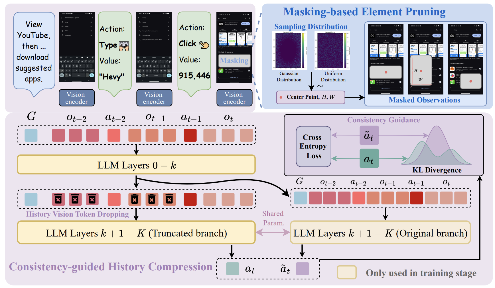| [Github](https://github.com/JiuTian-VL/SimpAgent)   [Paper](https://arxiv.org/pdf/2507.03730)|
| Mirage-1: Augmenting and Updating GUI Agent with Hierarchical Multimodal Skills (2025-6) | 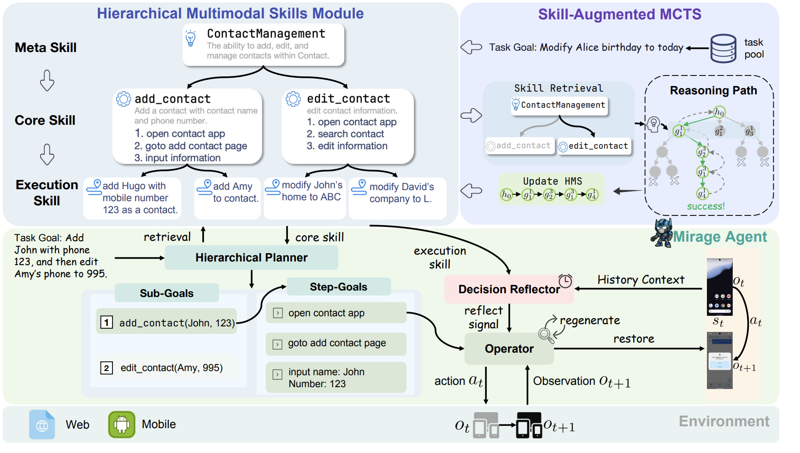| [Github](https://cybertronagent.github.io/Mirage-1.github.io/)   [Paper](https://arxiv.org/abs/2506.10387)|
| GUI-Explorer: Autonomous Exploration and Mining of Transition-aware Knowledge for GUI Agent (2025-5, 2025ACL) | 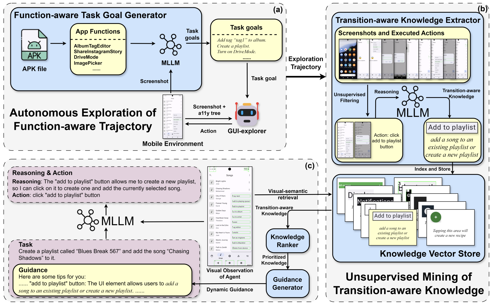| [Github](https://github.com/JiuTian-VL/GUI-explorer)   [Paper](https://arxiv.org/pdf/2505.16827)|
| MobileA^3gent: Training Mobile GUI Agents Using Decentralized Self-Sourced Data from Diverse Users (2025-5) | 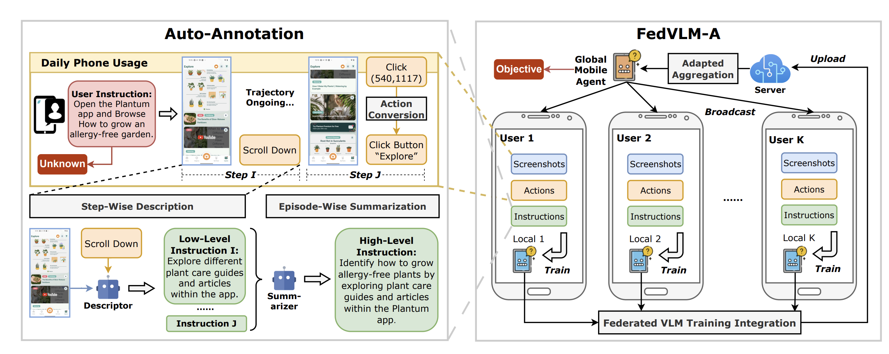| [Github](https://anonymous.4open.science/r/MobileA3gent-Anonymous)   [Paper](https://arxiv.org/pdf/2502.02982)|
| Advancing Mobile GUI Agents: A Verifier-Driven  Approach to Practical Deployment (2025-3) |  | [Github]()   [Paper](https://www.arxiv.org/abs/2503.15937) |
| API Agents vs. GUI Agents: Divergence and Convergence (2025-3) |  | [Github]()   [Paper](https://arxiv.org/abs/2503.11069) |
| AppAgentX: Evolving GUI Agents as Proficient Smartphone Users (2025-3) |  | [Github](https://github.com/Westlake-AGI-Lab/AppAgentX)   [Paper](https://arxiv.org/pdf/2503.02268) |
| Think Twice, Click Once: Enhancing GUI Grounding via Fast and Slow Systems (2025-3) |  | [Github](https://github.com/sugarandgugu/Focus)   [Paper](https://arxiv.org/pdf/2503.06470) |
| UI-TARS: Pioneering Automated GUI Interaction with Native Agents  (2025-2) |  | [Github](https://github.com/bytedance/UI-TARS)   [Paper](https://arxiv.org/abs/2501.12326) |
| Mobile-Agent-E: Self-Evolving Mobile Assistant for Complex Tasks (2025-1) |  | [Github](https://github.com/X-PLUG/MobileAgent/tree/main/Mobile-Agent-E)   [Paper](https://arxiv.org/abs/2501.11733) |
| InfiGUIAgent: A Multimodal Generalist GUI Agent with Native Reasoning and Reflection (2025-1) |  | [Github](https://github.com/Reallm-Labs/InfiGUIAgent)   [Paper](https://arxiv.org/abs/2501.04575) |
| OS-Genesis: Automating GUI Agent Trajectory Construction via  Reverse Task Synthesis (2024-12) |  | [Github](https://github.com/OS-Copilot/OS-Genesis)   [Paper](https://arxiv.org/abs/2412.19723) |
| PC Agent: While You Sleep, AI Works - A Cognitive Journey into Digital World (2024-12) |  | [Github](https://github.com/GAIR-NLP/PC-Agent)   [Paper](https://arxiv.org/abs/2412.17589) |
| Aria-UI: Visual Grounding for GUI Instructions (2024-12) |  | [Github](https://github.com/AriaUI/Aria-UI)   [Paper](https://arxiv.org/abs/2412.16256) |
| Iris: Breaking GUI Complexity with Adaptive Focus and Self-Refining (2024-12) | 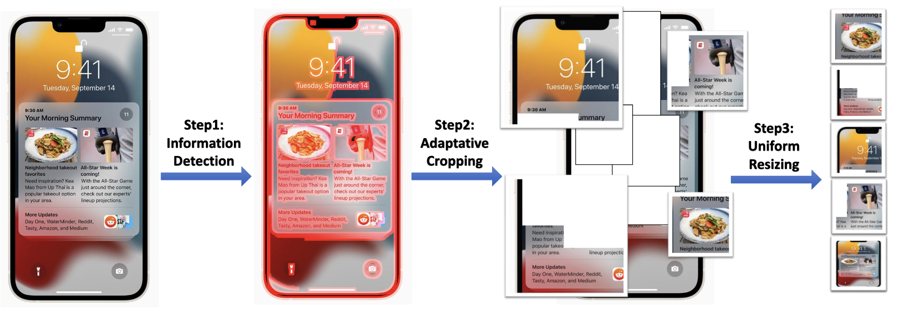 | [Github]()   [Paper](https://arxiv.org/abs/2412.10342) |
| AgentTrek : AGENT TRAJECTORY SYNTHESIS  VIA GUIDING REPLAY WITH WEB TUTORIALS (2024-12) | 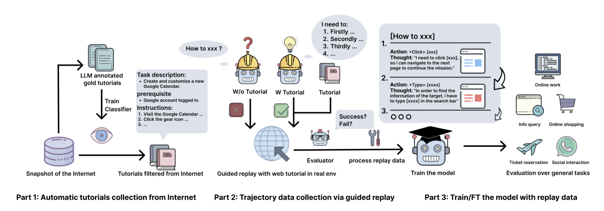 | [Github](https://github.com/xlang-ai/AgentTrek)   [Paper](https://arxiv.org/abs/2412.09605) |
| AGUVIS: UNIFIED PURE VISION AGENTS FOR  AUTONOMOUS GUI INTERACTION (2024-12) | 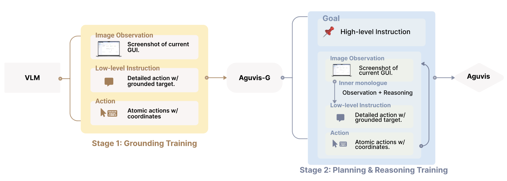 | [Github](https://github.com/xlang-ai/aguvis)   [Paper](https://arxiv.org/abs/2412.04454) |
| Ponder & Press: Advancing Visual GUI Agent  towards General Computer Control (2024-12) |   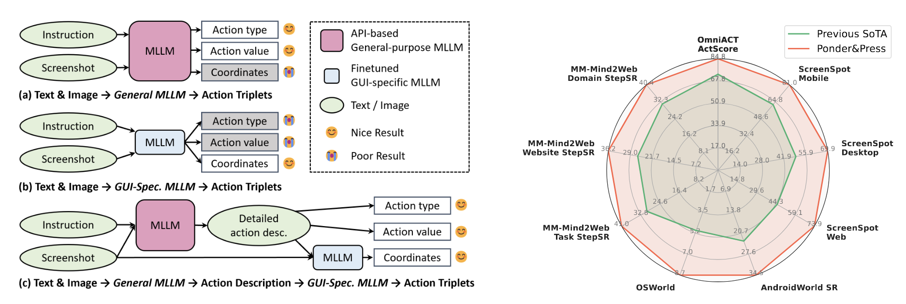    |  [Github]()   [Paper](https://arxiv.org/abs/2412.01268)  |
| ShowUI: One Vision-Language-Action Model for GUI Visual Agent (2024-11) |       | [Github](https://github.com/showlab/ShowUI)   [Paper](https://arxiv.org/abs/2411.17465) |
| The Dawn of GUI Agent: A Preliminary  Case Study with Claude 3.5 Computer Use (2024-11) |    |  [Github]()   [Paper](https://arxiv.org/abs/2411.10323)  |
| MobA: Multifaceted Memory-Enhanced Adaptive Planning for Efficient Mobile Task Automation (2024-10) (2025 NAACL Demo) |  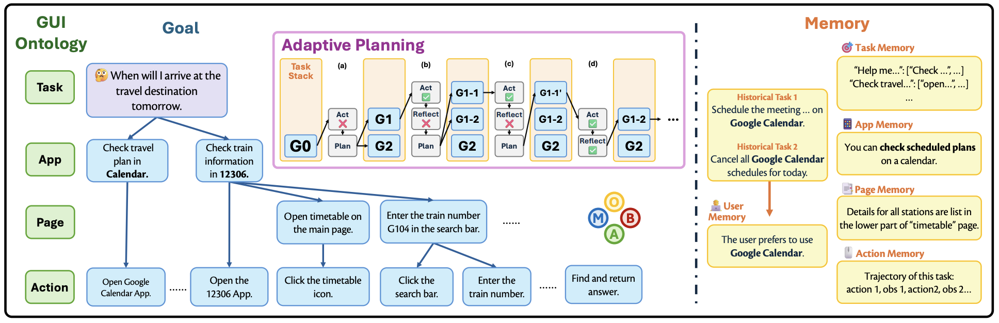  |  [Github](https://github.com/OpenDFM/MobA/)   [Paper](https://aclanthology.org/2025.naacl-demo.43/)  |
| OS-ATLAS: A FOUNDATION ACTION MODEL FOR  GENERALIST GUI AGENTS (2024-10) |   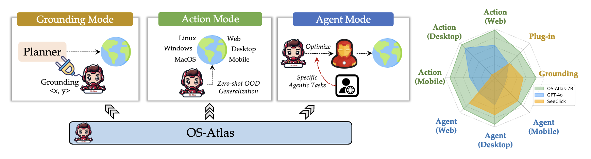   | [Github](https://github.com/OS-Copilot/OS-Atlas)   [Paper](https://arxiv.org/abs/2410.23218) |
| AutoGLM: Autonomous Foundation Agents for GUIs (2024-10)     |   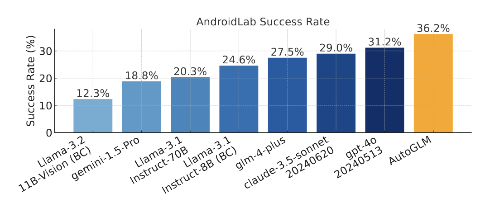   |  [Github]()   [Paper](https://arxiv.org/abs/2411.00820)  |
| FERRET-UI 2: MASTERING UNIVERSAL USER INTERFACE UNDERSTANDING ACROSS PLATFORMS (2024-10) |  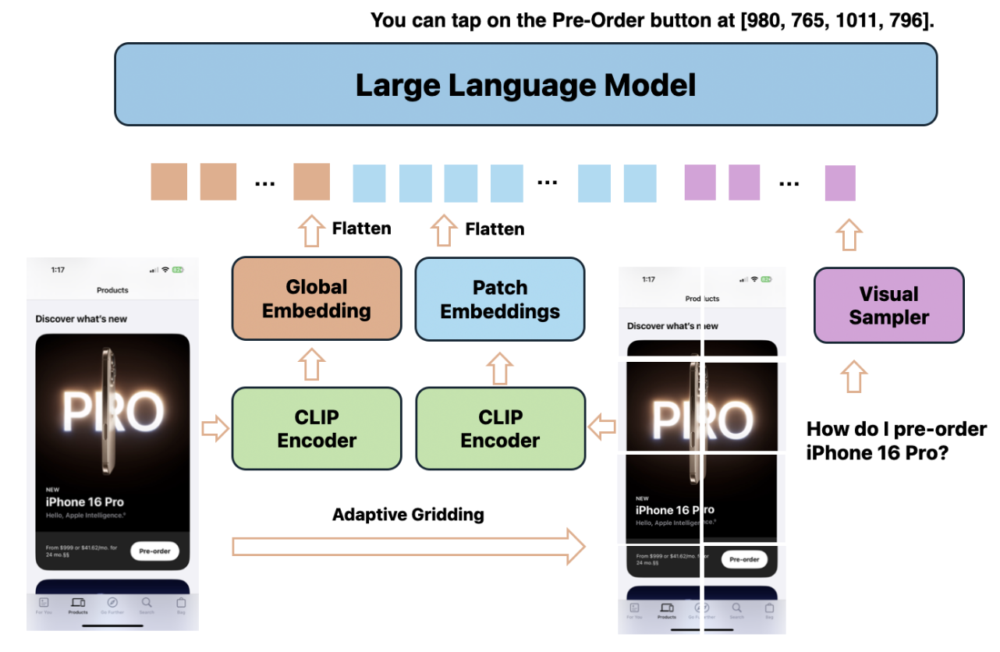  | [Github](https://github.com/apple/ml-ferret)   [Paper](https://arxiv.org/abs/2410.18967) |
| AutoWebGLM: A Large Language Model-based Web Navigating Agent  (2024-10) | 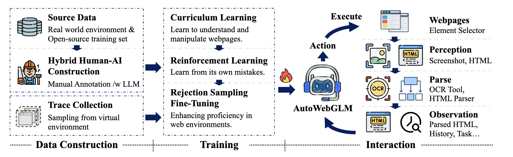  | [Github](https://github.com/THUDM/AutoWebGLM)   [Paper](https://arxiv.org/abs/2404.03648) |
| AGENT S: AN OPEN AGENTIC FRAMEWORK THAT  USES COMPUTERS LIKE A HUMAN  (2024-10) |   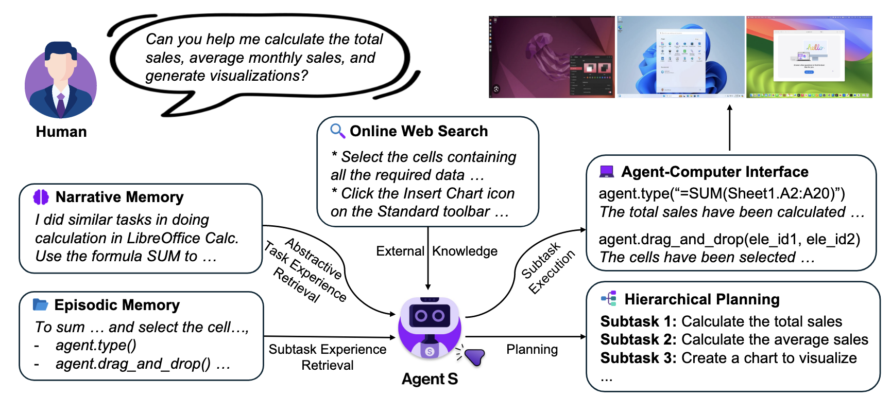    | [Github](https://github.com/simular-ai/Agent-S)   [Paper](https://arxiv.org/abs/2410.08164) |
| Navigating the Digital World as Humans Do:  UNIVERSAL VISUAL GROUNDING FOR GUI AGENTS (2024-10) |   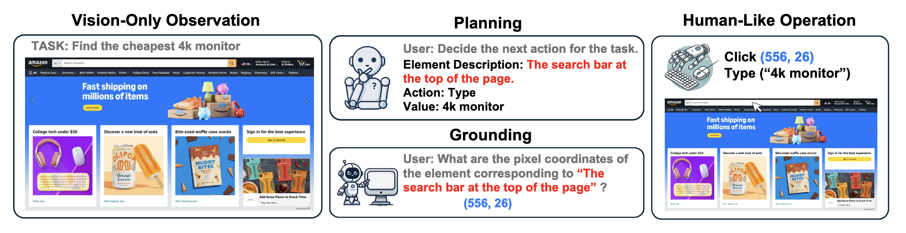   | [Github](https://github.com/OSU-NLP-Group/UGround)   [Paper](https://arxiv.org/abs/2410.05243) |
| MOBILEFLOW: A MULTIMODAL LLM FOR MOBILE GUI AGENT (2024-8)   | 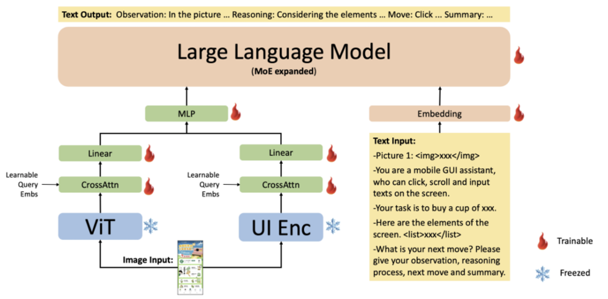  |  [Github]()   [Paper](https://arxiv.org/abs/2407.04346)  |
| AppAgent v2: Advanced Agent for Flexible Mobile Interactions (2024-8) | 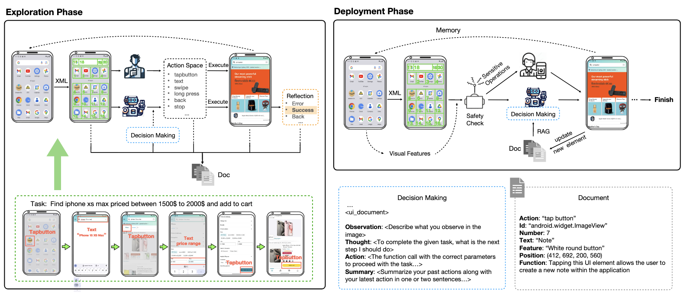  | [Github](https://github.com/TencentQQGYLab/AppAgent)   [Paper](https://arxiv.org/abs/2408.11824) |
| OmniParser for Pure Vision Based GUI Agent (2024-8)          | 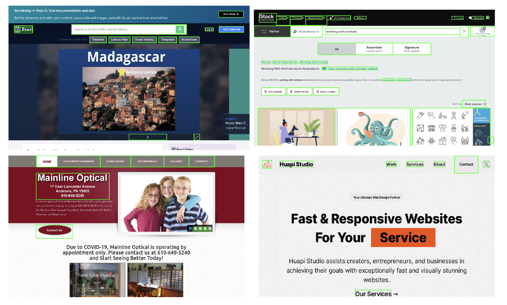  | [Github](https://github.com/microsoft/OmniParser)   [Paper](https://arxiv.org/abs/2408.00203) |
| OmniACT: A Dataset and Benchmark for Enabling  Multimodal Generalist Autonomous Agents for Desktop (2024-7) |   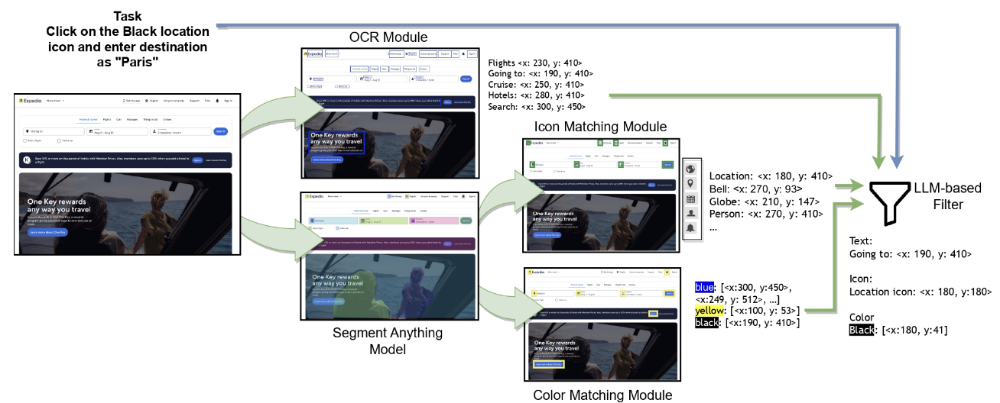   |  [Github]()   [Paper](https://arxiv.org/abs/2402.17553)  |
| Android in the Zoo: Chain-of-Action-Thought for GUI Agents (2024-7) |    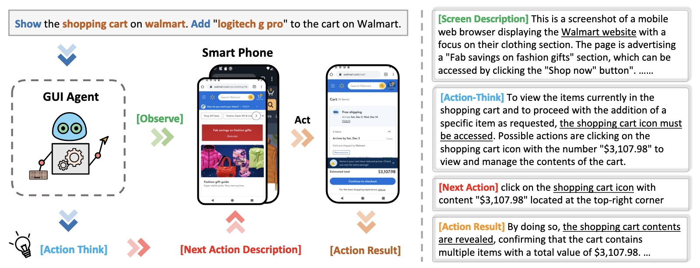     | [Github](https://github.com/IMNearth/CoAT)   [Paper](https://arxiv.org/abs/2403.02713) |
| CRADLE: Empowering Foundation Agents Towards General Computer Control (2024-7) |   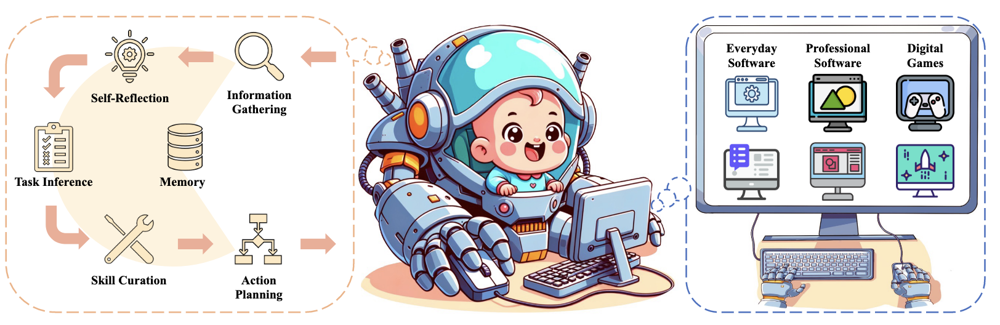    | [Github](https://github.com/BAAI-Agents/Cradle)   [Paper](https://arxiv.org/abs/2403.03186) |
| VGA: Vision GUI Assistant - Minimizing Hallucinations through Image-Centric Fine-Tuning (2024-6) |     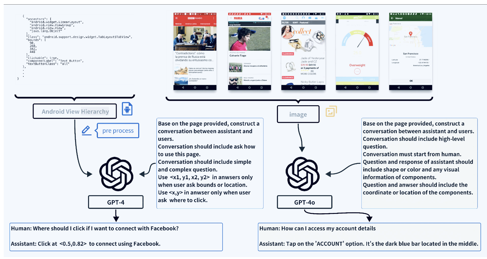     | [Github](https://github.com/Linziyang1999/Vision-GUI-assistant)   [Paper](https://arxiv.org/abs/2406.14056) |
| WebVoyager: Building an End-to-End Web Agent with Large Multimodal Models (2024-6) | 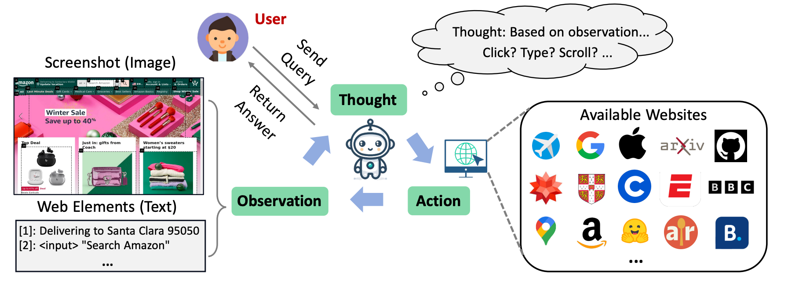  | [Github](https://github.com/MinorJerry/WebVoyager)   [Paper](https://arxiv.org/abs/2401.13919) |
| Mobile-Agent-v2: Mobile Device Operation Assistant with Effective Navigation via Multi-Agent Collaboration (2024-6) | 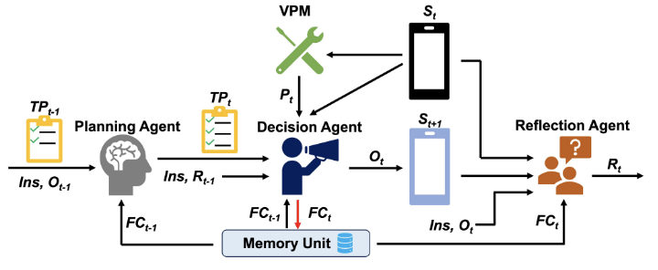 | [Github](https://github.com/X-PLUG/MobileAgent/tree/main/Mobile-Agent-v2)   [Paper](https://arxiv.org/abs/2406.01014) |
| SWE-agent: Agent-Computer Interfaces Enable Automated Software Engineering (2024-5) |  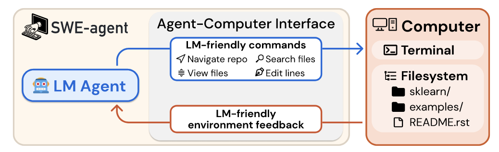   | [Github](https://github.com/SWE-agent/SWE-agent)   [Paper](https://arxiv.org/abs/2405.15793) |
| UFO : A UI-Focused Agent for Windows OS Interaction (2024-5) |     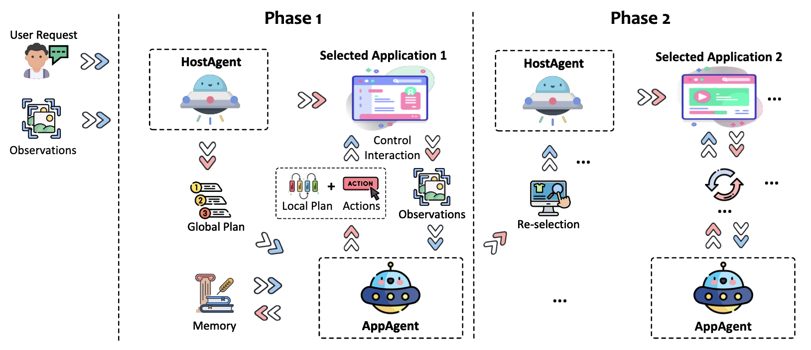     | [Github](https://github.com/microsoft/UFO)   [Paper](https://arxiv.org/abs/2402.07939) |
| MOBILE-AGENT: AUTONOMOUS MULTI-MODAL MOBILE  DEVICE AGENT WITH VISUAL PERCEPTION (2024-4) | 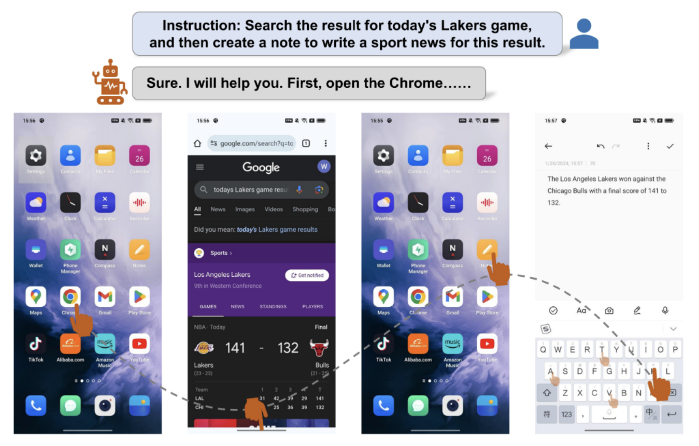 | [Github](https://github.com/X-PLUG/MobileAgent/tree/main/Mobile-Agent)   [Paper](https://arxiv.org/abs/2401.16158) |
| WebArena: A REALISTIC WEB ENVIRONMENT FOR  BUILDING AUTONOMOUS AGENTS (2024-4) |     | [Github](https://github.com/web-arena-x/webarena)   [Paper](https://arxiv.org/abs/2307.13854) |
| TRAINING A VISION LANGUAGE MODEL AS  SMARTPHONE ASSISTANT (2024-4) |  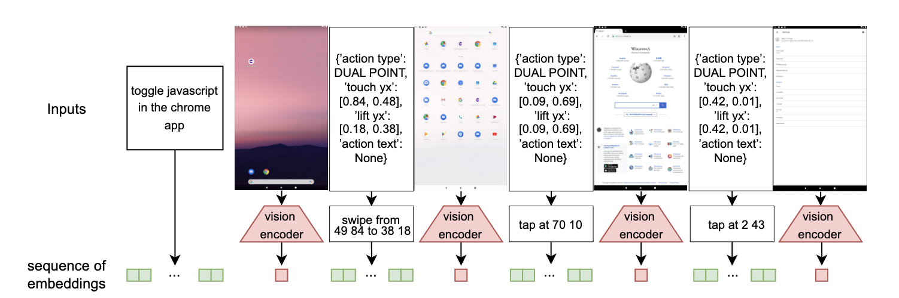   |  [Github]()   [Paper](https://arxiv.org/abs/2404.08755)  |
| GPT-4V(ision) is a Generalist Web Agent, if Grounded (SeeAct)(2024-3) | 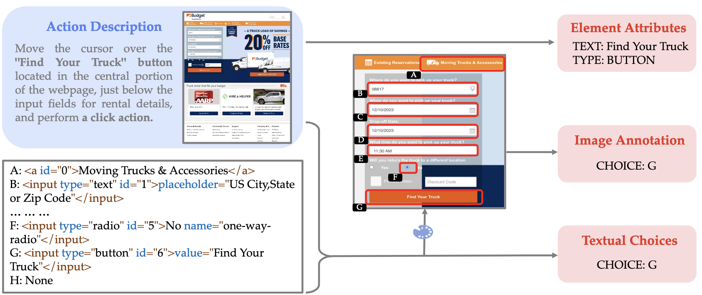 | [Github](https://github.com/OSU-NLP-Group/SeeAct)   [Paper](https://arxiv.org/abs/2401.01614) |
| AutoDroid: LLM-powered Task Automation in Android (2024-3)   |  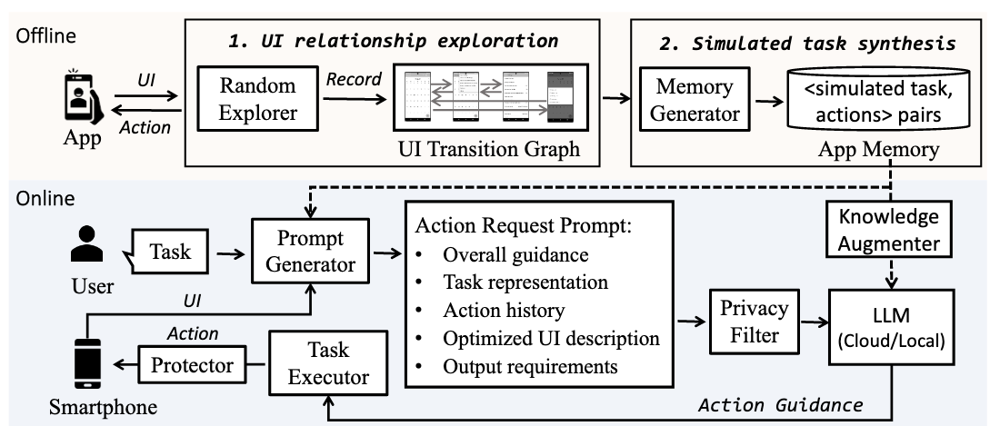  | [Github](https://github.com/MobileLLM/AutoDroid)   [Paper](https://arxiv.org/abs/2308.15272) |
| SeeClick: Harnessing GUI Grounding for Advanced Visual GUI Agents (2024-2) |  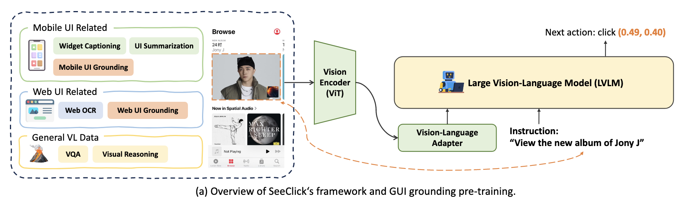   | [Github](https://github.com/njucckevin/SeeClick)   [Paper](https://arxiv.org/abs/2401.10935) |
| OS-Copilot: Towards Generalist Computer Agents with Self-Improvement (2024-2) |  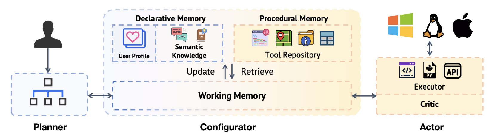  | [Github](https://github.com/OS-Copilot/OS-Copilot)   [Paper](https://arxiv.org/abs/2402.07456) |
| Understanding the Weakness of Large Language Model Agents within a Complex Android Environment (2024-2) | 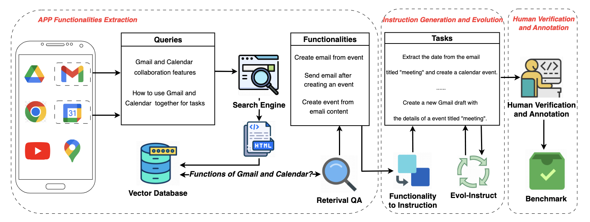 |  [Github]()   [Paper](https://arxiv.org/abs/2402.06596)  |
| MOBILEAGENT: ENHANCING MOBILE CONTROL VIA  HUMAN-MACHINE INTERACTION AND SOP INTEGRATION (2024-1) | 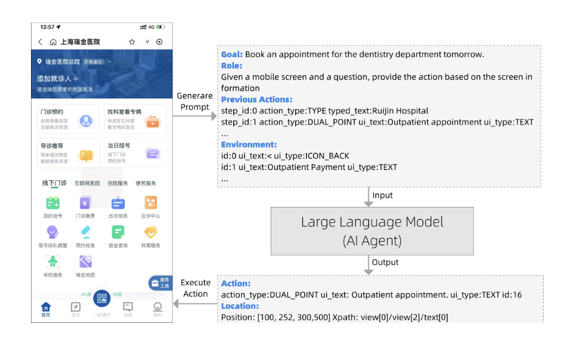 |  [Github]()   [Paper](https://arxiv.org/abs/2401.04124)  |
| ASSISTGUI: Task-Oriented Desktop Graphical User Interface Automation (2024-1) |  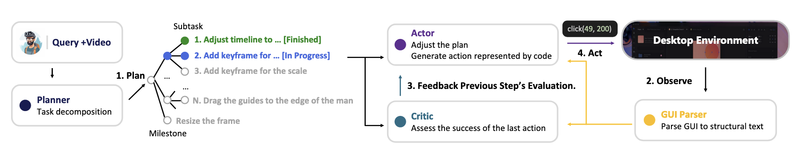  | [Github](https://github.com/showlab/assistgui)   [Paper](https://arxiv.org/abs/2312.13108) |
| AppAgent: Multimodal Agents as Smartphone Users （2023-12）  |  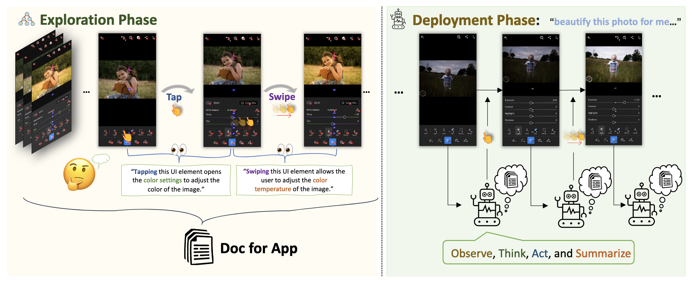   | [Github](https://github.com/TencentQQGYLab/AppAgent)   [Paper](https://arxiv.org/abs/2312.13771) |
| CogAgent: A Visual Language Model for GUI Agents （2023-12） | 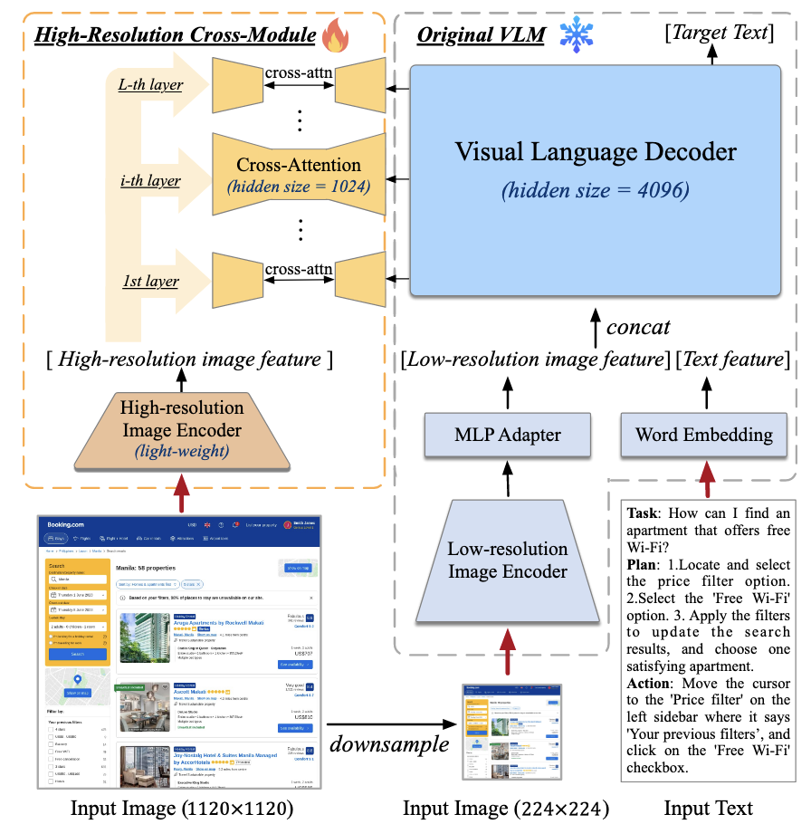 | [Github](https://github.com/THUDM/CogAgent)   [Paper](https://arxiv.org/abs/2312.08914) |
| MIND2WEB: Towards a Generalist Agent for the Web （2023-12） | 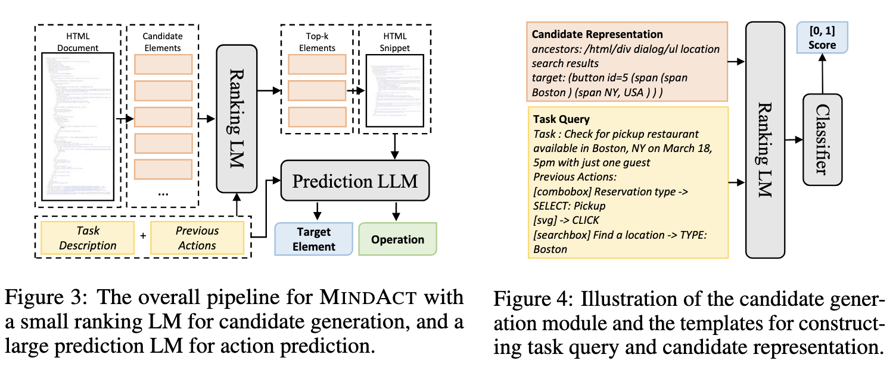 | [Github](https://github.com/OSU-NLP-Group/Mind2Web)   [Paper](https://arxiv.org/abs/2306.06070) |
| Set-of-Mark Prompting Unleashes  Extraordinary Visual Grounding in GPT-4V （2023-11） | 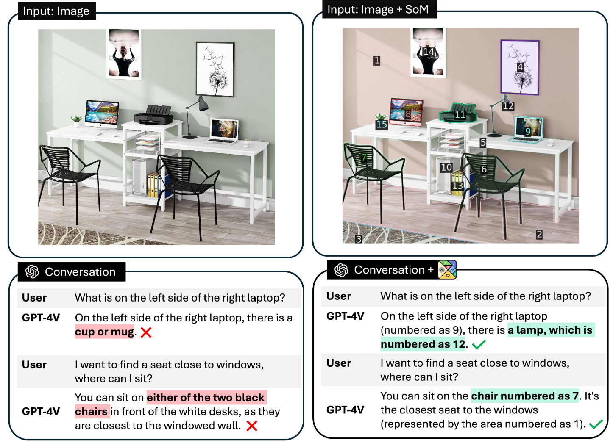 | [Github](https://github.com/microsoft/SoM)   [Paper](https://arxiv.org/abs/2310.11441) |
| META-GUI: Towards Multi-modal Conversational Agents on Mobile GUI (2022-12) |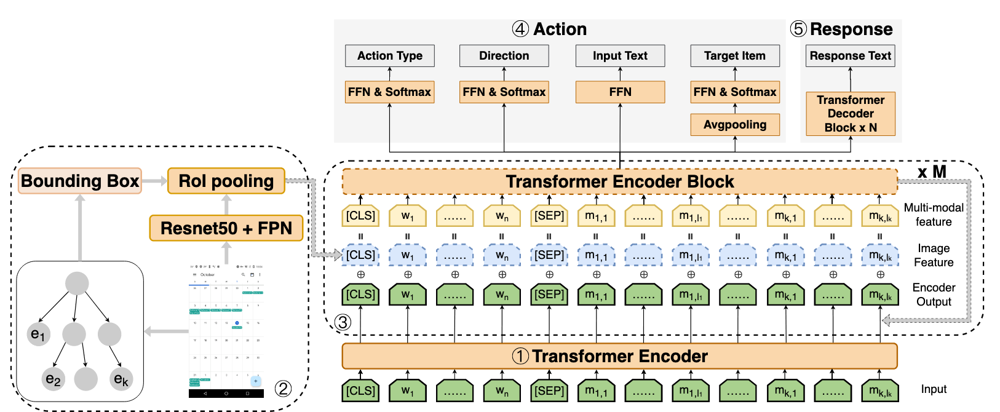 |[Github](https://github.com/X-LANCE/META-GUI-baseline)   [Paper](https://arxiv.org/abs/2205.11029)|
|UIBert: Learning Generic Multimodal Representations for UI Understanding (2021-8) |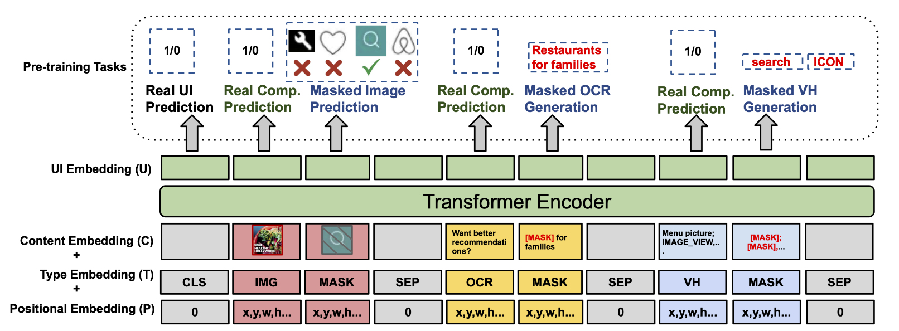 |[Github](https://github.com/google-research-datasets/uibert)   [Paper](https://arxiv.org/abs/2107.13731)|

### [GUI Agents  Datasets & Benchmark List](#datasets)
| Title & Time                                                 |                         Introduction                         |                            Links                             |
| :----------------------------------------------------------- | :----------------------------------------------------------: | :----------------------------------------------------------: |
| UI-E2I-Synth: Advancing GUI Grounding with Large-Scale Instruction Synthesis （2025-04） | 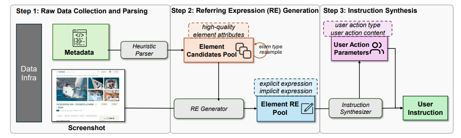 | [Github](https://colmon46.github.io/i2e-bench-leaderboard/)   [Paper](https://arxiv.org/abs/2504.11257) |
| Ui-vision: A desktop-centric gui benchmark for visual perception and interaction （2025-03） | 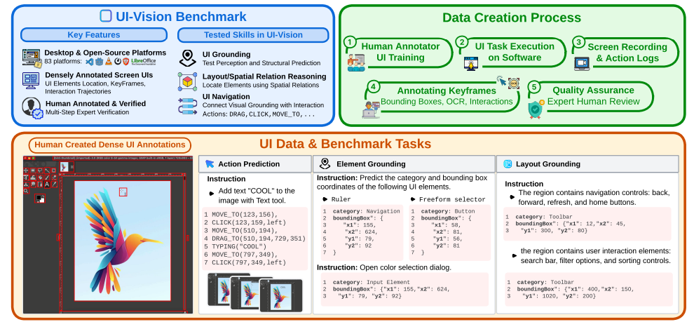 | [Github](https://uivision.github.io/)   [Paper](https://arxiv.org/abs/2503.15661) |
| Worldgui: Dynamic testing for comprehensive desktop gui automation （2025-02） | 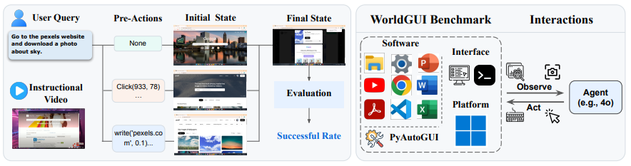 | [Github](https://github.com/showlab/WorldGUI)   [Paper](https://arxiv.org/abs/2502.08047) |
| Screenspot-pro: Gui grounding for professional high-resolution computer use （2025-01） | 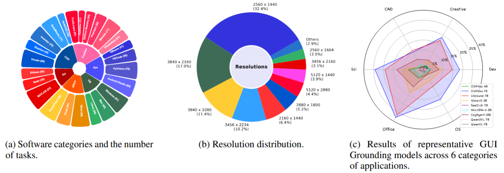 | [Github](https://github.com/likaixin2000/ScreenSpot-Pro-GUI-Grounding)   [Paper](https://openreview.net/forum?id=XaKNDIAHas&referrer=%5Bthe%20profile%20of%20Tat-Seng%20Chua%5D(%2Fprofile%3Fid%3D~Tat-Seng_Chua2)) |
| Webwalker: Benchmarking llms in web traversal （2025-01）    | 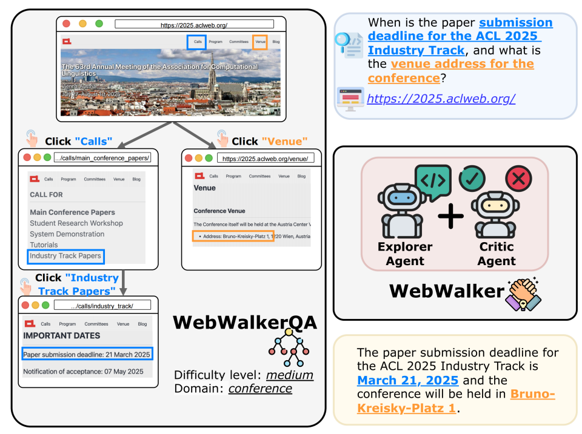 | [Github](https://github.com/Alibaba-NLP/WebWalker)   [Paper](https://arxiv.org/abs/2501.07572) |
| A3: Android agent arena for mobile gui agents （2025-01）    | 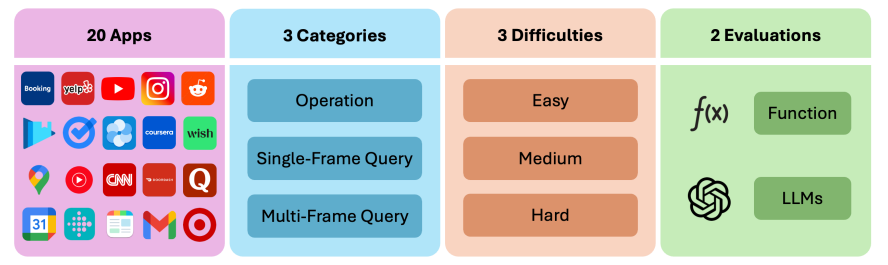 | [Github](https://yuxiangchai.github.io/Android-Agent-Arena/)   [Paper](https://arxiv.org/abs/2501.01149) |
| Gui testing arena: A unified benchmark for advancing autonomous gui testing agent （2024-12） | 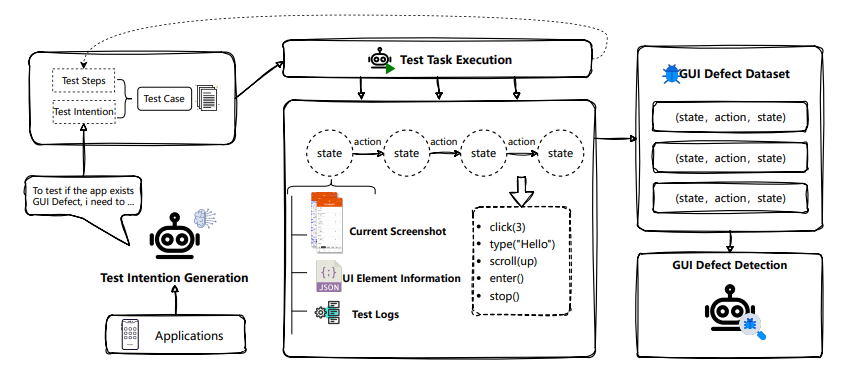 | [Github](https://github.com/ZJU-ACES-ISE/ChatUITest)   [Paper](https://arxiv.org/abs/2412.18426) |
| Harnessing web page uis for text-rich visual understanding （2024-11） | 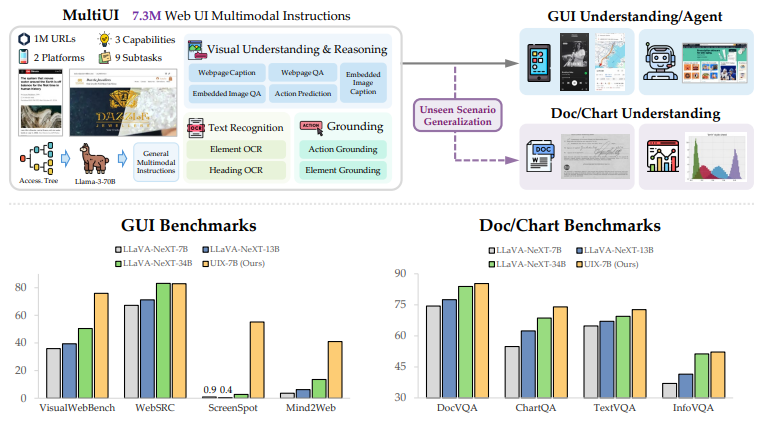 | [Github](https://neulab.github.io/MultiUI/)   [Paper](https://arxiv.org/abs/2410.13824) |
| On the effects of data scale on computer control agents （2024-11） | 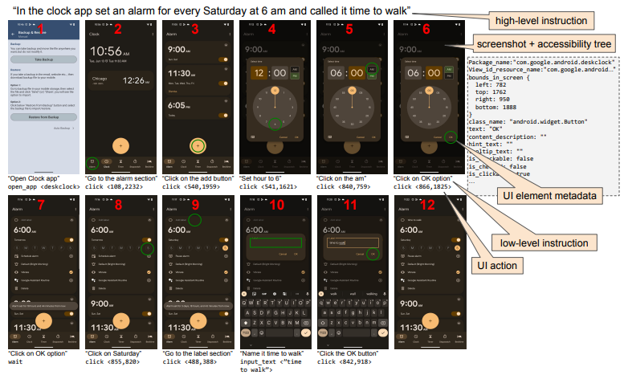 | [Github](https://github.com/google-research/google-research/tree/master/android_control)   [Paper](https://arxiv.org/abs/2406.03679) |
| AndroidLab: training and systematic benchmarking of android autonomous agents（2024-10） | 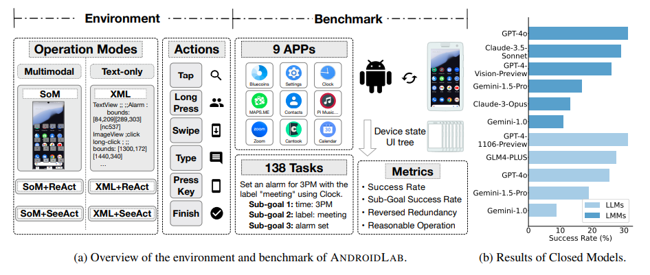 | [Github](https://github.com/THUDM/Android-Lab)   [Paper](https://arxiv.org/abs/2410.24024) |
| Spa-bench: A comprehensive benchmark for smartphone agent evaluation （2024-10） | 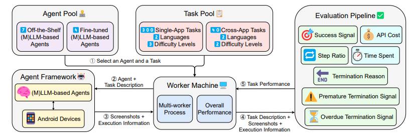 | [Github](https://ai-agents-2030.github.io/SPA-Bench/)   [Paper](https://arxiv.org/abs/2410.15164) |
| Read anywhere pointed: Layout-aware gui screen reading with tree of-lens grounding （2024-10） | 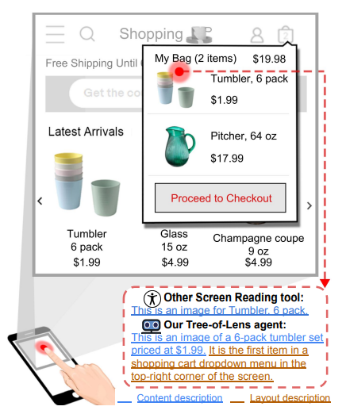 | [Github](https://screen-point-and-read.github.io/)   [Paper](https://arxiv.org/abs/2406.19263) |
| Crab: Cross environment agent benchmark for multimodal lan guage model agents （2024-10） | 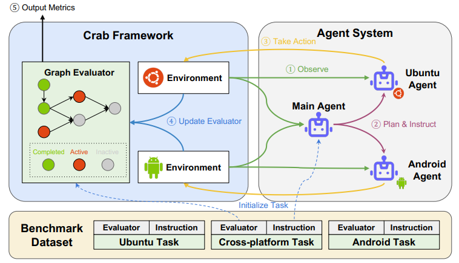 | [Github](https://github.com/camel-ai/crab)   [Paper](https://arxiv.org/abs/2407.01511) |
| Androidworld: A dynamic benchmarking environment for autonomous agents （2024-10） | 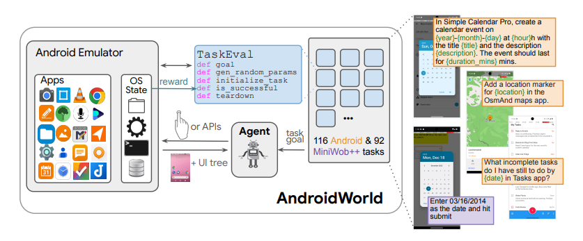 | [Github](http://github.com/google-research/android_world)   [Paper](https://arxiv.org/abs/2405.14573) |
| Benchmarking mobile device control agents across diverse configurations （2024-10） | 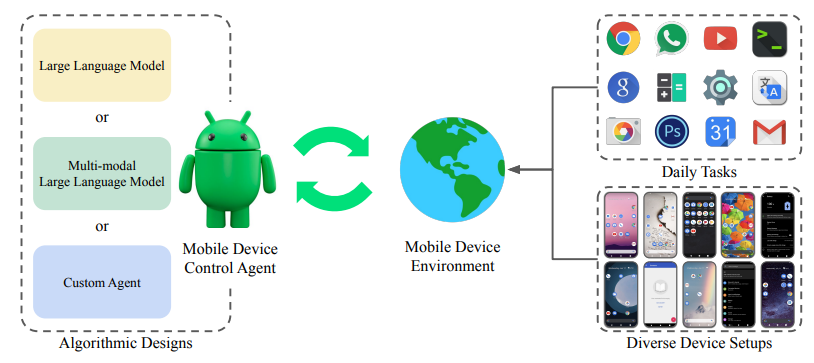 | [Github](https://b-moca.github.io/)   [Paper](https://arxiv.org/abs/2404.16660) |
| Agentstudio: A toolkit for building general virtual agents （2024-10） | 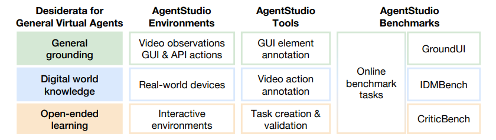 | [Github](https://ltzheng.github.io/agent-studio)   [Paper](https://arxiv.org/abs/2403.17918) |
| Weblinx: Real world website navigation with multi-turn dialogue （2024-10） | 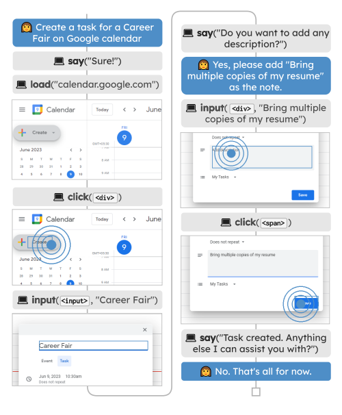 | [Github](https://mcgill-nlp.github.io/weblinx)   [Paper](https://arxiv.org/abs/2402.05930) |
| Windows agent arena: Evaluating multi-modal os agents at scale （2024-09） | 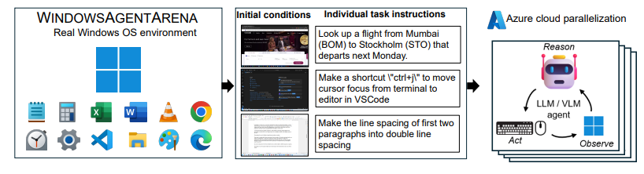 | [Github](https://github.com/microsoft/WindowsAgentArena)   [Paper](https://arxiv.org/abs/2409.08264) |
| Understanding the weakness of large lan guage model agents within a complex android en vironment （2024-09） | 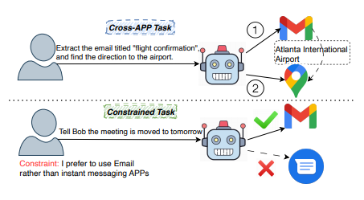 | [Github](https://github.com/AndroidArenaAgent/AndroidArena)   [Paper](https://arxiv.org/abs/2402.06596) |
| Llamatouch: A faithful and scalable testbed for mobile ui automation task evaluation （2024-08） | 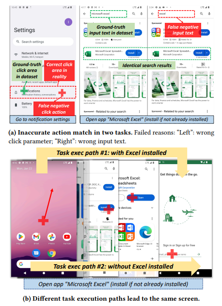 | [Github](https://github.com/LlamaTouch/LlamaTouch)   [Paper](https://arxiv.org/abs/2404.16054) |
| Amex: Android multi annotation expo dataset for mobile gui agents （2024-07） | 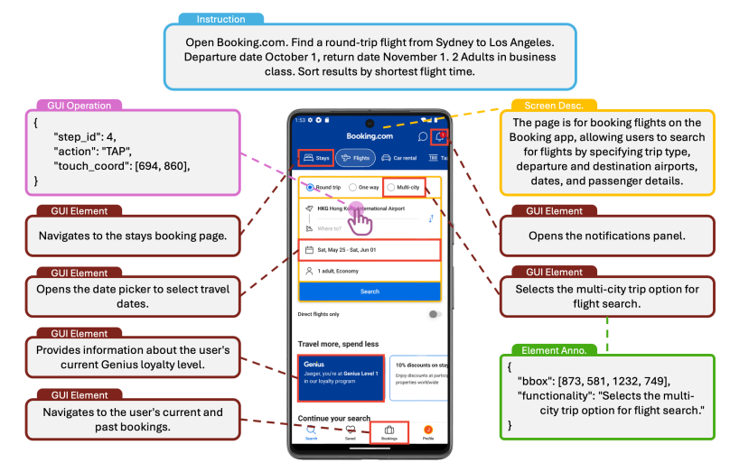 | [Github](https://yuxiangchai.github.io/AMEX/)   [Paper](https://arxiv.org/abs/2407.17490) |
| Omniact: A dataset and benchmark for enabling multimodal generalist autonomous agents for desktop and web （2024-07） | 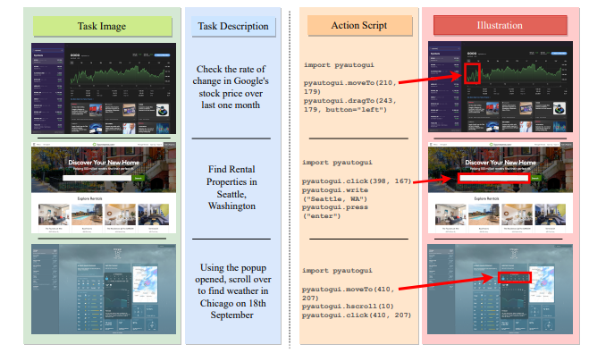 | [HuggingFace](https://huggingface.co/datasets/Writer/omniact)  [Paper](https://arxiv.org/abs/2402.17553) |
| Spider2-v: Howfar are multimodal agents from automating data science and engineering workflows? （2024-07） | 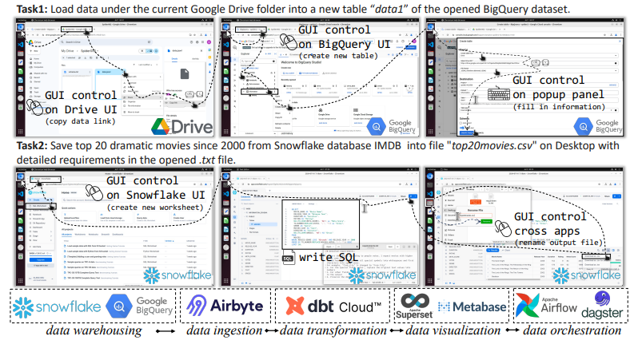 | [Github](https://spider2-v.github.io/)   [Paper](https://arxiv.org/abs/2407.10956) |
| Webcanvas: Benchmarking web agents in online environments （2024-07） | 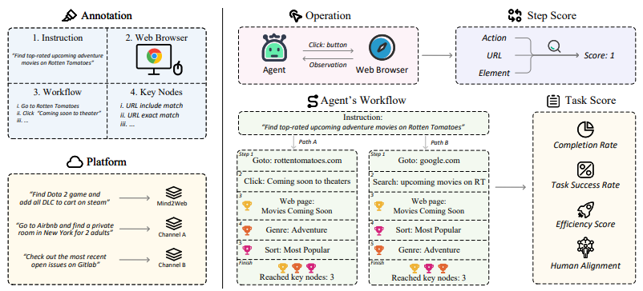 | [HuggingFace](https://huggingface.co/datasets/iMeanAI/Mind2Web-Live)   [Paper](https://arxiv.org/abs/2406.12373) |
| Gui odyssey: A comprehensive dataset for cross-app gui navigation on mobile devices （2024-06） | 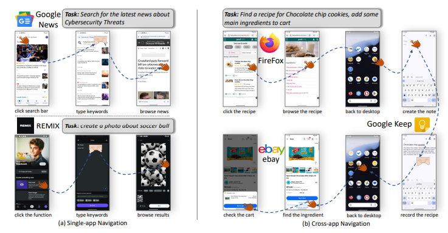 | [Github](https://github.com/OpenGVLab/GUI-Odyssey)   [Paper](https://arxiv.org/abs/2406.08451) |
| Gui-world: A dataset for gui-oriented multimodal llm-based agents （2024-06） | 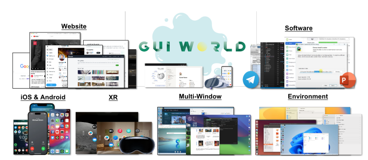 | [Github](https://gui-world.github.io/)   [Paper](https://arxiv.org/abs/2406.10819) |
| Guicourse: From general vision language models to versatile gui agents （2024-06） | 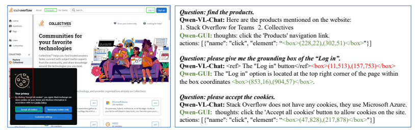 | [Github](https://github.com/yiye3/GUICourse)   [Paper](https://arxiv.org/abs/2406.11317) |
| Mobileagentbench: An efficient and user-friendly benchmark for mobile llm agents （2024-06） | 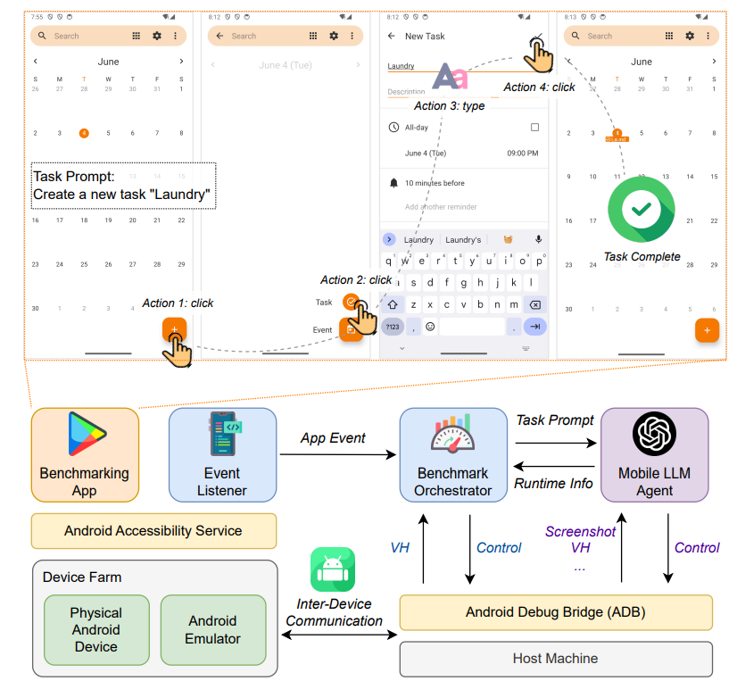 | [Github](https://mobileagentbench.github.io/)   [Paper](https://arxiv.org/abs/2406.08184) |
| Videogui: A benchmark for gui automation from instructional videos （2024-06） | 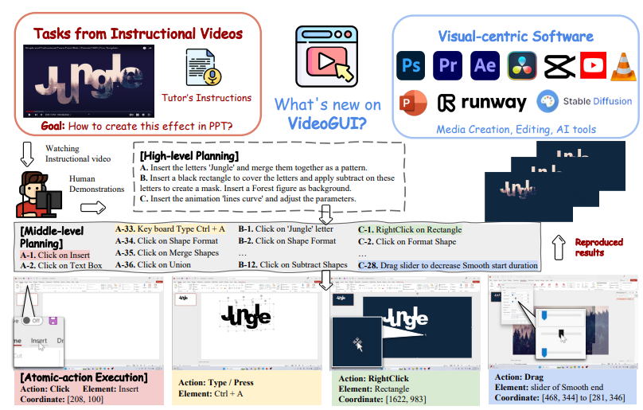 | [Github](https://showlab.github.io/videogui/)   [Paper](https://arxiv.org/abs/2406.10227) |
| Visualwebarena: Evaluating multimodal agents on realistic visual web tasks （2024-06） | 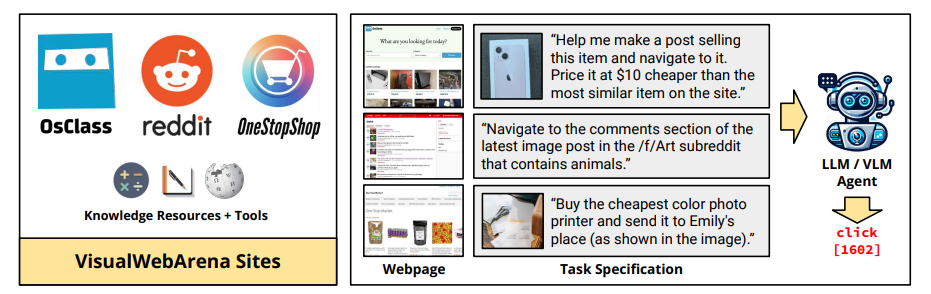 | [HomePage](https://jykoh.com/vwa)   [Paper](https://arxiv.org/abs/2401.13649) |
| Mobile-env: an evaluation platform and benchmark for llm-gui interaction （2024-06） | 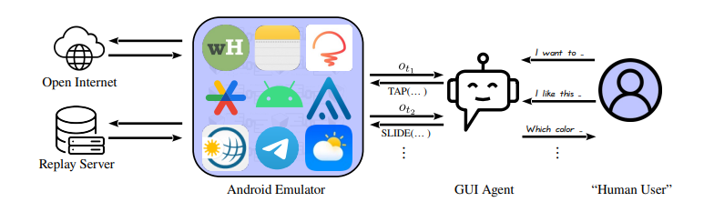 | [Github](https://github.com/X-LANCE/Mobile-Env)   [Paper](https://arxiv.org/abs/2305.08144) |
| Os world: Benchmarking multimodal agents for open ended tasks in real computer environments （2024-05） | 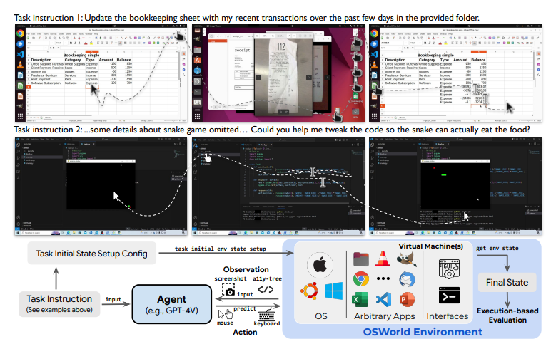 | [Github](https://os-world.github.io/)   [Paper](https://arxiv.org/abs/2404.07972) |
| Visualwebbench: How far have multi modal llms evolved in web page understanding and grounding? （2024-04） | 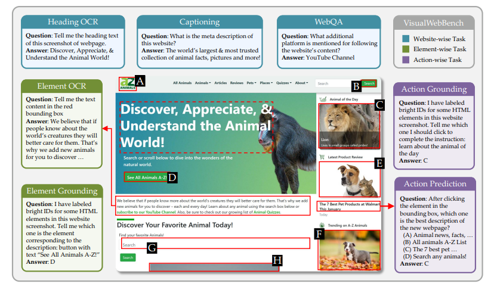 | [Github](https://github.com/microsoft/LMOps/tree/main/minillm)   [Paper](https://arxiv.org/abs/2404.05955) |
| Mmina: Benchmarking multihop multimodal internet agents （2024-04） | 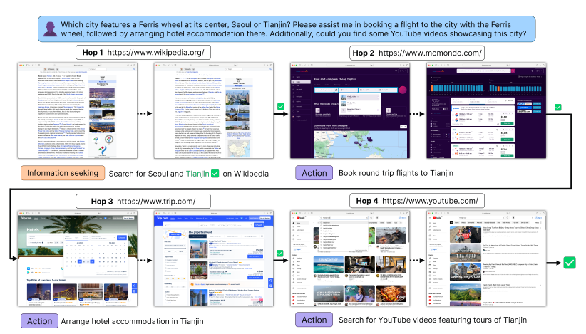 | [HomePage](https://mmina.cliangyu.com/)   [Paper](https://arxiv.org/abs/2404.09992) |
| Webarena: Arealistic web environment for building autonomous agents （2024-04） | 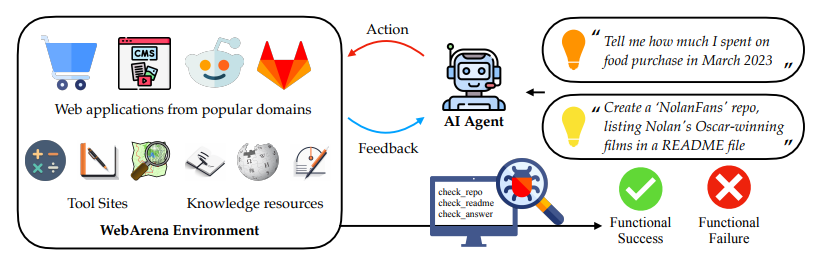 | [HomePage](https://webarena.dev/)   [Paper](https://arxiv.org/abs/2307.13854) |
| Webvln: Vision-and-language navigation on websites （2024-03） |  | [Github](https://github.com/WebVLN/WebVLN)   [Paper](https://arxiv.org/abs/2312.15820) |
| On the multi-turn instruction fol lowing for conversational web agents （2024-02） | 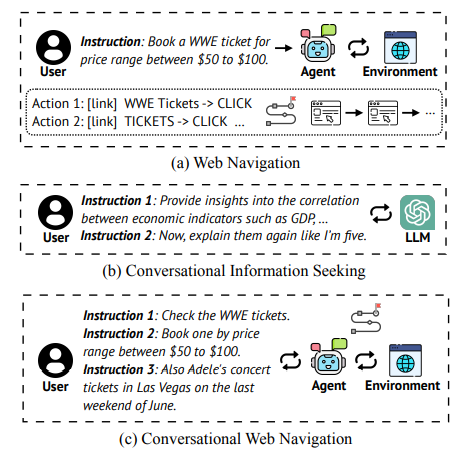 | [Github](https://github.com/magicgh/self-map)   [Paper](https://arxiv.org/abs/2402.15057) |
| Assist gui: Task-oriented desktop graphical user interface automation （2024-01） | 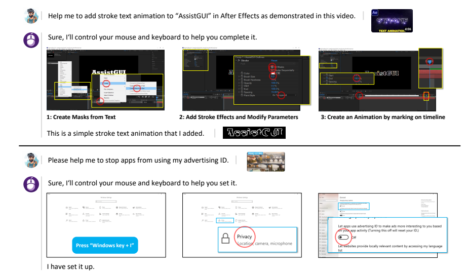 | [Github](https://showlab.github.io/assistgui/)   [Paper](https://arxiv.org/abs/2312.13108) |
| Mind2web: Towards a generalist agent for the web （2023-12） | 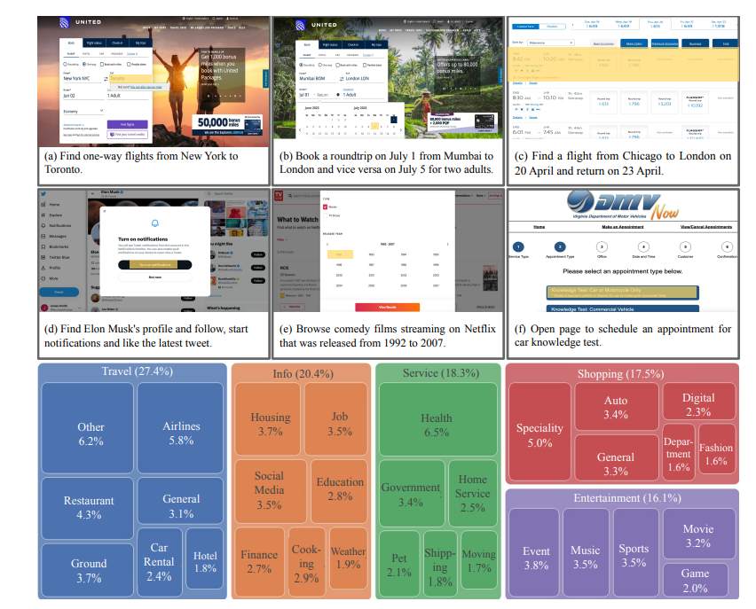 | [Github](https://osu-nlp-group.github.io/Mind2Web)   [Paper](https://arxiv.org/abs/2306.06070) |
| Androidinthewild: A large-scale dataset for an droid device control （2023-10） | 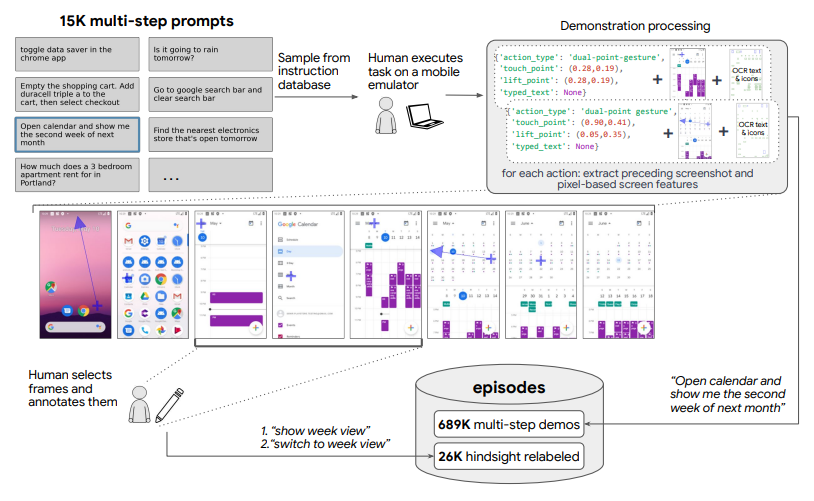 | [Github](https://github.com/google-research/google-research/tree/master/android_in_the_wild)   [Paper](https://arxiv.org/abs/2307.10088) |
| Web shop: Towards scalable real-world web interaction with grounded language agents （2023-02） | 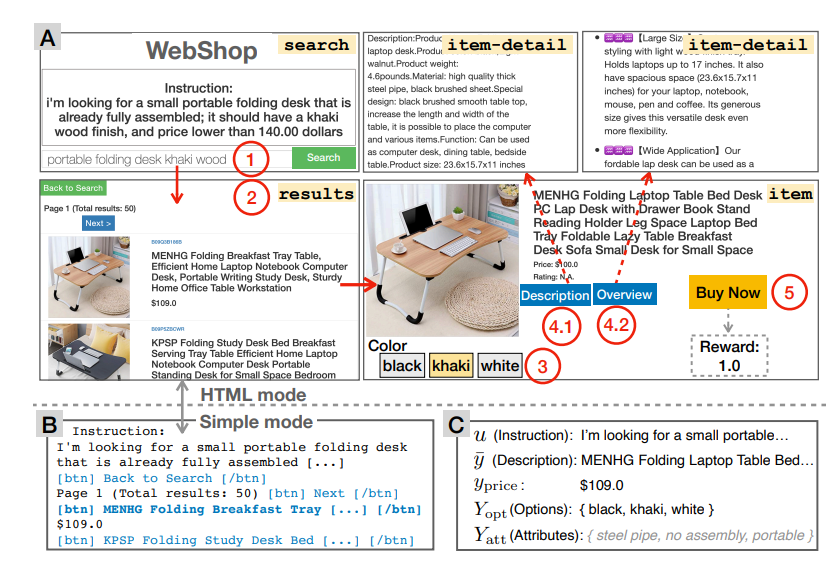 | [Github](https://webshop-pnlp.github.io/)   [Paper](https://arxiv.org/abs/2207.01206) |
| Meta-gui: Towards multi-modal con versational agents on mobile gui （2022-11） |  | [Github](https://x-lance.github.io/META-GUI-Leaderboard/)   [Paper](https://arxiv.org/abs/2205.11029) |
| A dataset for interactive vision language navigation with unknown command fea sibility （2022-08） | 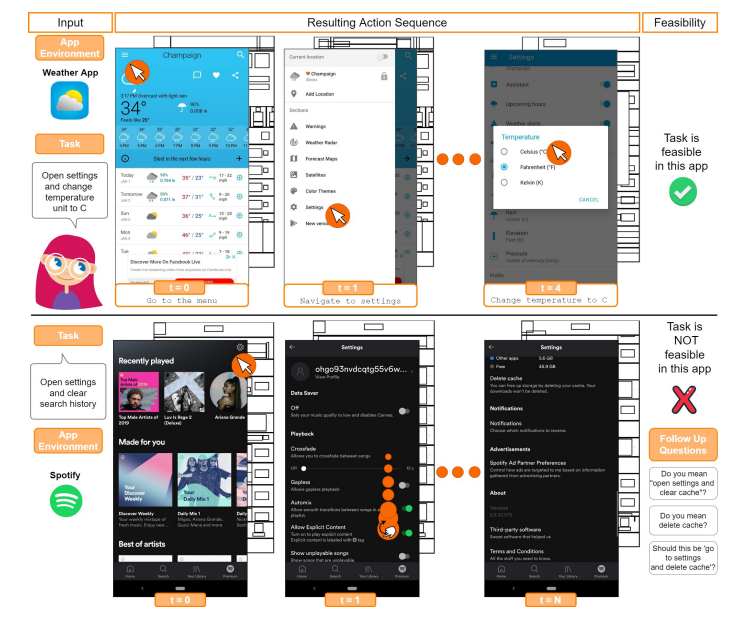 | [Github](https://github.com/aburns4/MoTIF)   [Paper](https://arxiv.org/abs/2202.02312) |
| Websrc: A dataset for web-based structural reading comprehension （2021-11） | 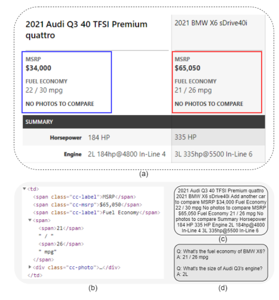 | [Github](https://x-lance.github.io/WebSRC/)   [Paper](https://arxiv.org/abs/2101.09465) |
| Mapping natural language instructions to mobile ui action sequences （2020-06） |  | [Github](https://github.com/google-research/google-research/tree/master/seq2act)   [Paper](https://arxiv.org/abs/2005.03776) |
| Reinforcement learning on web interfaces using workflow-guided exploration （2018-02） | 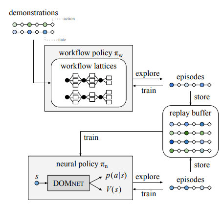 | [Github](https://github.com/stanfordnlp/wge)   [Paper](https://arxiv.org/abs/1802.08802) |
| Rico: A mobile app dataset for building data-driven design applications （2017-10） | 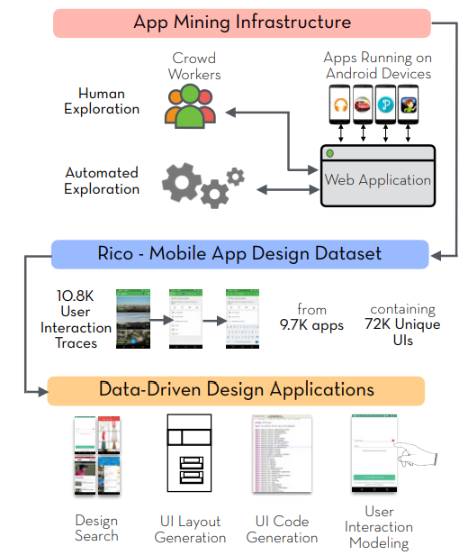 | [HomePage](http://interactionmining.org/rico)   [Paper](https://dl.acm.org/doi/10.1145/3126594.3126651) |
| World of bits: An open-domain platform for web based agents （2017-08） | 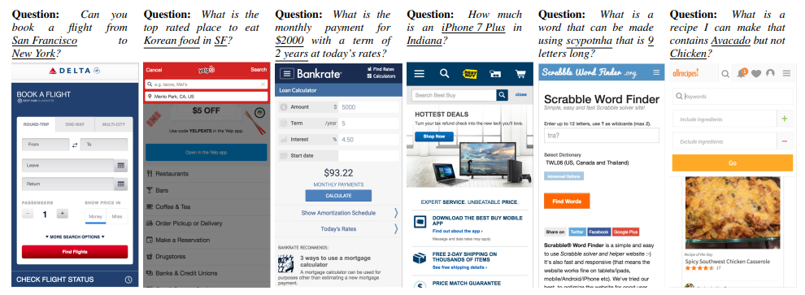 |    [Paper](https://proceedings.mlr.press/v70/shi17a.html)    |
